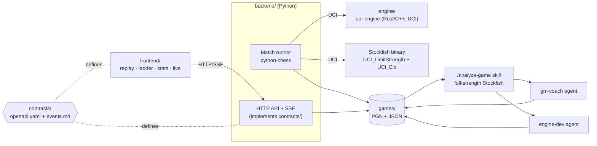

# 02 · Architecture



## Components

| Component | Responsibility | Suggested tech | Owner |
|---|---|---|---|
| **Engine** | Given a position + time limit, return the best move. Speaks **UCI** so any harness/GUI can drive it. | Rust or C++ (see [04-engine](04-engine.md)) | Engine dev(s) |
| **Match runner** | Launches engine + Stockfish, configures `UCI_LimitStrength`/`UCI_Elo`, plays with `Limit(time=5.0)`, adjudicates, writes files, triggers analysis. | Python + `python-chess` | Backend dev |
| **API** | Serves the contract: matches, PGN, analysis, ladder, stats, SSE. Reads the game store. | Python (FastAPI) | Backend dev |
| **Game store** | Append-only files on disk (simple, git-friendly, easy to hand in as evidence). | Folder layout below | Backend dev |
| **Analysis** | Claude Code skill + two sub-agents; writes `analysis.json`. | `.claude/skills`, `.claude/agents` | Anyone |
| **Frontend** | Replay, ladder, stats, live view. Talks **only** to the contract. | React + Vite + `@lichess-org/chessground` + `chess.js` | Frontend dev(s) |

The match runner can also be used headless from the CLI (the `/loop` ladder uses it directly);
the API is a thin layer on top.

## Game store layout

```
games/
  <matchId>/
    game.pgn          # evidence — immutable after the game ends
    match.json        # contract `Match` schema — immutable after the game ends
    analysis.json     # contract `Analysis` schema — written by the skill
    analysis-history/ # previous analyses when re-run
  index.json          # optional cache of MatchSummary[] for fast listing
```

`matchId` format: `m_<yyyymmdd>_<elo>_<nnn>` (e.g. `m_20260925_1500_001`), unique and sortable.

## Match flow

1. Request (API or CLI) → match record `queued`.
2. Runner starts both engines, configures Stockfish (`UCI_LimitStrength=true`, `UCI_Elo`,
   fixed `Threads`/`Hash`), records settings → `running`, emits `match.started`.
3. Loop: side to move gets `Limit(time=5.0)`; runner measures wall time, validates legality,
   appends the move, emits `move.played`. Over 5 s → loss on `time-limit-exceeded`.
4. Game ends → write `game.pgn` + `match.json`, emit `match.finished`.
5. Trigger analysis skill → `analysis.json` fills in (engine eval, then both agent reports),
   emitting `analysis.updated`.
6. Ladder/stats are derived from the store (never stored separately as source of truth).

## Why these choices
- **UCI everywhere**: the engine is testable with standard tools (cutechess/fastchess) and
  swappable in the runner.
- **Files, not a DB**: the saved games *are* the competition evidence; files are simple to
  inspect, commit and hand in.
- **Contract in the middle**: backend and frontend can be built in parallel
  ([08-parallel-work](08-parallel-work.md)).
